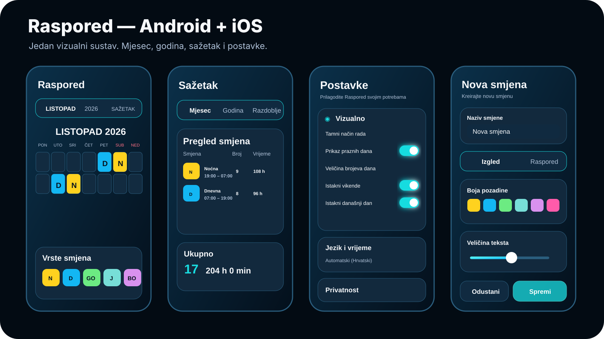
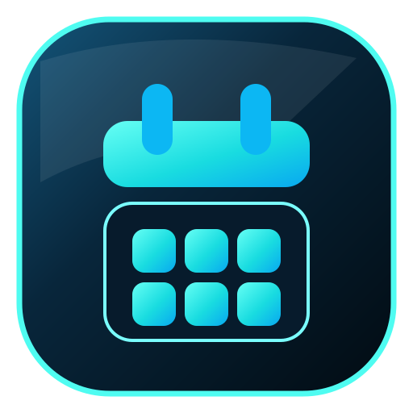

  

  <strong>Pametni planer smjena za Android i iOS.</strong> 
  Brz, privatan i vizualno usklađen raspored rada s preciznim obračunom sati.

  <code>Android 8.0+</code>
  <code>iOS 17+</code>
  <code>Kotlin + Compose</code>
  <code>Swift + SwiftUI</code>
  <code>v1.6.0</code>

  <a href="https://github.com/bren-wp/SHIFTERICA/releases/latest"><strong>Preuzmi najnovije izdanje</strong></a>
  ·
  <a href="#mogućnosti">Mogućnosti</a>
  ·
  <a href="#obračun-radnog-vremena">Obračun sati</a>
  ·
  <a href="#privatnost-i-sigurnost">Privatnost</a>

---

## Raspored na prvi pogled

  

Raspored je napravljen za korisnike koji rade u smjenama i žele jasan kalendar bez nepotrebnih računa, oglasa i složenih administracijskih ekrana. Namijenjen je državnim i javnim službama, privatnom sektoru i drugim radnim okruženjima bez vezivanja uz jednu ustanovu ili profesiju. Android i iOS imaju isti vizualni jezik, iste hrvatske nazive i isti način rada.

Sve grafike prikazane u ovom README-u nalaze se u repozitoriju. Aplikacija ne preuzima logotipe, ikone, pozadine ili druge vizualne resurse s CDN-a.

## Mogućnosti

| | Mogućnost | Opis |
|---|---|---|
| 📅 | **Mjesečni kalendar** | Aplikacija se otvara na trenutačnom mjesecu, uz brzu promjenu mjeseca. |
| 🗓️ | **Godišnji pregled** | Godina ostaje poredana od siječnja do prosinca, a prikaz se otvara na trenutačnom mjesecu. |
| ⏱️ | **Precizan obračun sati** | Redovni sati, fond sati, odrađeni sati, prekovremeni sati, plaćene odsutnosti i ukupno priznato vrijeme. |
| 💶 | **Automatska procjena plaće** | Iz rasporeda automatski procjenjuje bruto/neto bez dodatnih postavki obračuna. |
| 🌙 | **Smjene N i D** | Dnevna 07:00–19:00, noćna 19:00–07:00, obje po 12 sati. |
| 🌆 | **Popodnevna P** | Zadano 14:00–22:00, ukupno 8 sati. |
| ☀️ | **Jutarnja smjena** | Jutarnja 07:00–15:00, ukupno 8 sati. |
| 🛠️ | **Vlastite smjene** | Ugrađene D/N/J/P smjene imaju fiksno vrijeme radi točnog obračuna; vlastite smjene mogu imati vlastite intervale i rad preko ponoći. |
| 🏖️ | **GO i BO** | Godišnji odmor i bolovanje priznaju 8 sati na radni dan. |
| 🇭🇷 | **Hrvatski blagdani** | Prazan radni dan koji je državni blagdan priznaje se kao 8 sati. |
| 🎨 | **Boje smjena** | Korisnik može promijeniti boju kockice i teksta za N, D, P, J, GO i BO. |
| ➕ | **Vlastite smjene** | Naziv, skraćenica, boje, veličina teksta i do dva vremenska intervala. |
| 🔎 | **Pretraživanje** | Pronalaženje evidentiranih smjena prema datumu ili nazivu. |
| ⚙️ | **Postavke** | Izgled, vikendi, današnji datum, format vremena i datuma te bilješke. |
| ❤️ | **Dobrovoljna podrška** | Jednokratna podrška kroz Google Play Billing i Apple StoreKit; ne otključava funkcije. |
| 🔒 | **Privatnost** | Raspored i postavke ostaju na uređaju; nema oglasa ni oglasnih trackera. |

## Obračun radnog vremena

Ugrađene smjene koriste ove zadane vrijednosti:

| Oznaka | Smjena | Vrijeme | Evidencija |
|---|---|---:|---:|
| **D** | Dnevna | 07:00–19:00 | 12 h |
| **N** | Noćna | 19:00–07:00 | 12 h |
| **J** | Jutarnja | 07:00–15:00 | 8 h |
| **P** | Popodnevna | 14:00–22:00 | 8 h |
| **GO** | Godišnji odmor | — | 8 h na radni dan |
| **BO** | Bolovanje | — | 8 h na radni dan |

Fond sati računa radne dane od ponedjeljka do petka. Ako korisnik na radni dan koji je državni blagdan ostavi praznu ćeliju, aplikacija taj dan priznaje kao 8 sati. Odrađeno vrijeme iznad raspoloživog redovnog fonda prikazuje se kao prekovremeno.

Pravila su implementirana u zasebnom modulu za obračun i pokrivena automatiziranim testovima.

## Automatska procjena plaće

Procjena plaće ne traži ručni unos sati, iznosa niti parametara obračuna. Aplikacija koristi podatke koje već ima u kalendaru: fond, redovni rad, prekovremene sate, noćni rad, subote, nedjelje, blagdane, GO i BO. Parametri bolničkog profila ugrađeni su u obračunski modul i nisu izloženi u Postavkama niti ih korisnik može mijenjati.

Izračun je orijentacijski i nije zamjena za službenu platnu listu. Bez dodatnih osobnih podataka koristi se osnovni osobni odbitak. Logika za djecu i godišnju olakšicu za mlade ostaje u obračunskom modulu, ali nije nametnuta korisniku kao obvezan unos. Detalji održavanja i izvori nalaze se u `qa/PAYROLL_RULES_2026.md`.

## Vizualni identitet

  

Primarni naglasak je **#19DCE0**, uz tamnu podlogu **#061624**. Zadane boje smjena su:

| Oznaka | Smjena | Zadana boja |
|---|---|---|
| **N** | Noćna | 🟨 #FFD21F |
| **D** | Dnevna | 🟦 #13B7F3 |
| **GO** | Godišnji odmor | 🟩 #6CEB82 |
| **J** | Jutarnja | 🟢 #77DED7 |
| **P** | Popodnevna | 🟧 #FF8A3D |
| **BO** | Bolovanje | 🟪 #D991EE |

Sve ugrađene boje mogu se promijeniti iz upravitelja smjena i ostaju spremljene na uređaju. Vrijeme ugrađenih smjena ostaje zaključano radi dosljednog obračuna: D 07:00–19:00, N 19:00–07:00, J 07:00–15:00 i P 14:00–22:00. Vlastite smjene i dalje mogu imati vlastite intervale.

## Android

Android izdanje koristi **Kotlin + Jetpack Compose + Material 3**.

- minimalno: Android 8.0 / API 26
- target: API 36
- Google Play Billing Library 9.1 za dobrovoljnu podršku
- APK za instalaciju i QA
- AAB za Google Play distribuciju

## iOS

iOS izdanje koristi **Swift 5.10 + SwiftUI + StoreKit 2**.

- minimalno: iOS 17
- Simulator .app
- unsigned .xcarchive
- unsigned .ipa

Za instalaciju na fizički uređaj, TestFlight ili App Store potreban je odgovarajući Apple certifikat i provisioning profil.

## Privatnost i sigurnost

Raspored je projektiran tako da osobni raspored rada ostaje na uređaju:

- nema korisničkog računa
- nema oglasa ni oglasnih trackera
- raspored se ne šalje na vlastiti udaljeni poslužitelj
- aplikacijski vizualni resursi ne ovise o CDN-u
- Android zabranjuje cleartext promet i sigurnosne kopije aplikacijskih podataka
- iOS uključuje Privacy Manifest
- dobrovoljnu kupnju obrađuje isključivo trgovina platforme; aplikacija ne prima podatke platne kartice

## Stabilnost i održavanje

Kod je podijeljen u manje, tematski jasne module. Veliki UI i model fajlovi razdvojeni su na ekran, komponente, pohranu, obračun i platformsku integraciju kako bi izmjene bile sigurnije i jednostavnije za pregled.

CI provjerava:

- Android unit testove
- Android lint
- nedovršene produkcijske oznake TODO, FIXME, HACK i XXX
- Android APK i AAB build
- iOS Simulator build
- iOS uređajni archive bez potpisa
- pakiranje distribucijskih artefakata

## Razvoj i build

### Android

~~~bash
cd android
gradle :app:testDebugUnitTest
gradle :app:lintDebug
gradle :app:assembleDebug :app:bundleDebug
~~~

### iOS

~~~bash
brew install xcodegen
xcodegen generate --spec ios/project.yml

xcodebuild \
  -project ios/Raspored.xcodeproj \
  -scheme Raspored \
  -sdk iphonesimulator \
  CODE_SIGNING_ALLOWED=NO \
  build
~~~

## Struktura repozitorija

~~~text
SHIFTERICA/
├── android/                 # Android aplikacija i testovi
├── ios/                     # iOS aplikacija
├── docs/                    # lokalni vizualni resursi i dokumentacija
├── qa/                      # QA i dead-code audit
├── .github/workflows/       # CI i release pipeline
├── CHANGELOG.md
├── VERSION
└── README.md
~~~

## Izdanje

Najnovija razvojna verzija je **v1.6.0**. GitHub Release objavljuje se tek nakon zelenih Android i iOS buildova na glavnoj grani.

➡️ [GitHub Releases](https://github.com/bren-wp/SHIFTERICA/releases/latest)

## Licenca

Projekt je dostupan pod MIT licencom. Pogledajte [LICENSE](LICENSE).

---

  <strong>Raspored</strong> 
  Pametni planer smjena za uredniji radni mjesec.

